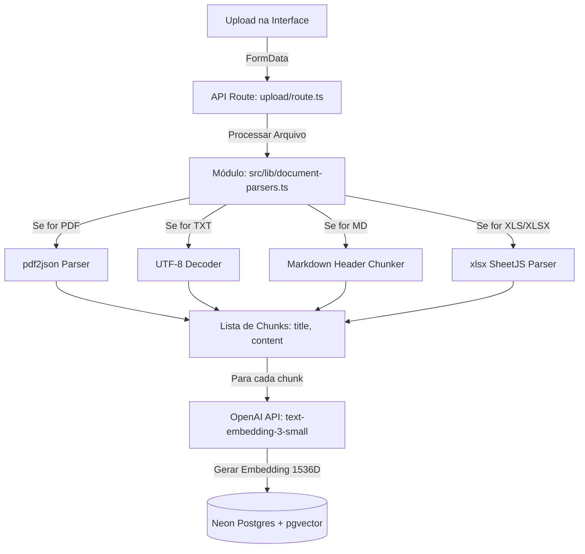

# Design Document: Upload e Extração de Markdown (.md) e Excel (.xls/.xlsx) para Base RAG

**Data:** 2026-05-28  
**Autor:** Antigravity  
**Status:** Aprovado  

---

## 1. Objetivo e Contexto

Este documento detalha o design técnico para implementar o suporte a novos formatos de arquivos na base de conhecimento (RAG) do **ExtrairLeads**. A base RAG permite que o agente autônomo (SDR) no WhatsApp responda a dúvidas de clientes usando dados corporativos oficiais contextualizados semanticamente por busca vetorial.

Atualmente, o sistema suporta apenas os formatos **PDF** e **TXT**. Este design estende essa capacidade para suportar:
1. **Markdown (`.md`):** Onde os chunks são divididos de forma inteligente respeitando os cabeçalhos do documento para manter a integridade semântica de cada seção.
2. **Excel (`.xls`, `.xlsx`):** Onde cada aba da planilha é convertida em uma tabela em formato Markdown. Em planilhas grandes, a tabela é dividida por linhas, replicando automaticamente o cabeçalho original no início de cada novo chunk para preservar o significado de cada coluna para a IA.

---

## 2. Arquitetura Proposta: Parser Modular e Desacoplado

Adotaremos uma **arquitetura de parsers modulares**, separando a lógica de tratamento de dados binários do endpoint da API HTTP Next.js. Isso melhora a legibilidade, simplifica a depuração e viabiliza testes unitários rápidos.

---

## 3. Especificações Técnicas e Implementação

### 3.1. Novas Dependências
Instalaremos a biblioteca `xlsx` para parsing de planilhas na CPU do servidor de rotas do Next.js:
* `npm install xlsx`

### 3.2. Parser de Documentos (`src/lib/document-parsers.ts`)

O arquivo conterá as seguintes rotinas principais:

1. **`parseMarkdownByHeaders(text: string, fileName: string)`**:
   * Escaneia títulos Markdown (`^#{1,6}\s+.*$`).
   * Consolida o texto contido entre cada cabeçalho.
   * Define o título do chunk como a concatenação do nome do arquivo com a árvore de cabeçalhos (ex: `manual.md > ## Preços`).
   * Retorna os chunks estruturados.

2. **`parseExcelToMarkdown(buffer: Buffer, fileName: string)`**:
   * Utiliza `XLSX.read(buffer, { type: 'buffer' })` para carregar o arquivo binário.
   * Itera sobre todas as abas (`Workbook.SheetNames`).
   * Para cada aba, converte as linhas em uma tabela Markdown.
   * Se o número de linhas exceder 20, gera múltiplos chunks, repetindo o cabeçalho original da tabela no topo de cada pedaço para garantir a compreensibilidade da IA.

---

## 4. Integração na API Route (`src/app/api/knowledge/upload/route.ts`)

A rota será adaptada para centralizar a chamada ao novo parser:
1. Validação inicial de `userId`, sessão e tamanho do arquivo (máximo de 10MB).
2. Criação do registro na tabela `documents` com status `processing`.
3. Invocação de `parseDocument(buffer, file.name, file.type)`.
4. Geração de embeddings na API da OpenAI (`text-embedding-3-small`) em lotes sequenciais ou paralelos.
5. Gravação das informações na tabela `knowledge_base` contendo o vetor (`vector(1536)`).
6. Transição do status em `documents` para `completed`. Em caso de qualquer erro, efetua o rollback deletando os pedaços salvos parcialmente e definindo o status do documento para `error`.

---

## 5. Estratégia de Teste e Validação

Criaremos uma suíte de testes unitários em `src/tests/document-parsers.test.ts` usando o **Vitest** (já configurado no projeto):
* **Caso 1:** Processamento correto de arquivo `.md` dividindo-o em seções pelas tags `#`.
* **Caso 2:** Processamento de planilha `.xlsx` gerando tabelas Markdown válidas.
* **Caso 3:** Processamento de planilhas extensas garantindo a réplica de cabeçalhos em chunks segmentados.
* **Caso 4:** Teste de falha graciosa e rejeição de tipos de arquivos desconhecidos.
